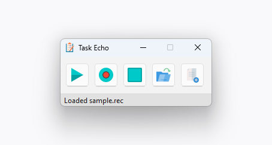

# Task Echo

A very simple easy-to-use program that allows you to automate stuff on your PC by recording and then replaying your actions. Written in Python using PyQt and pynput.

Works on Windows and Linux.

Made for a school project (and for fun) :3

### Hotkeys

You can also use hotkeys to perform actions:

**<kbd>Ctrl</kbd>+<kbd>Alt</kbd>+<kbd>P</kbd>** - Play\
**<kbd>Ctrl</kbd>+<kbd>Alt</kbd>+<kbd>R</kbd>** - Record\
**<kbd>Ctrl</kbd>+<kbd>Alt</kbd>+<kbd>S</kbd>** - Stop recording\
**<kbd>Ctrl</kbd>+<kbd>Alt</kbd>+<kbd>O</kbd>** - Open from file\
**<kbd>Ctrl</kbd>+<kbd>Alt</kbd>+<kbd>N</kbd>** - Save to a file

[Multimedia icons created by IconBaandar - Flaticon](https://www.flaticon.com/packs/multimedia-flat-colorful-14754831)\
[File icons and program's icon created by Freepik - Flaticon](https://www.flaticon.com/authors/freepik)
